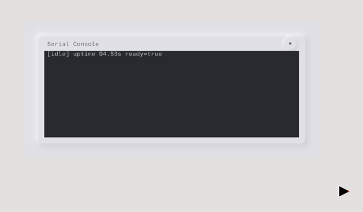

# News

## Apr 28, 2026

**A patched Go linker for true Go-only plugins.** *(landed Apr 18)* Stock
Go's `-buildmode=plugin` produces a shared object that falls back to the
system linker (`/usr/bin/ld`) at load time -- a nonstarter for an OS
that has no system linker. mazarin now ships a fork of `cmd/link` (and
a small piece of `cmd/go`) that emits a relocatable, self-contained
`.maz` plugin which loads at runtime through mazarin's own loader. The
plugin emits UNDEF dynsym entries against the host's runtime, a PLT and
GOT for resolution, and `DT_NEEDED=mazarin-host`. A
`dlopen-host-packages.txt` policy file declares which Go import paths
live in the host (chiefly `runtime`) so all other code ships inside the
plugin. This is the foundation that the rest of the plugin work below
rests on.

**One shepherd binary (mazdl).** *(landed Apr 18-28)* Every shepherd in
`startup.toml` is now a `.maz` plugin loaded by a single generic
`/shepherd.elf` host. The kernel-side `SysLoadMaz` and `SysRunMaz`
syscalls have been retired -- `mazdl` (the runtime loader matched to
the patched linker above) is the only loader. The work spanned a Phase
4 funcval rewrite to fix cross-module function-value indirection, a
`mazlink`/`mazgo` userspace toolchain for building plugins, and a
chunked `TransferPages` path so the kernel can move large mappings
between shepherds without hitting the old 4096-page cap. fti, maildb,
and mail migrated from ET_EXEC to `.maz` over the second half of the
window; on Apr 28, `launchShepherd`'s legacy ET_EXEC body in the fs
shepherd was deleted -- the disk no longer ships an `.elf` for any of
them.

**Mail v2 -- a working email client.** *(landed Apr 20-24)* mazarin has
a real mail client, written from scratch in mancini. It uses a
`GridTable` interactor for the message list with virtual scroll over a
fixed slot pool of `MailRow` interactors -- only as many rows are
materialized as fit on screen, and they are recycled as the user
scrolls. Keyboard navigation works (arrow keys, page up/down). Bodies
render in a `WebInteractor` HTML pane on click. The wire protocol is
`mailproto`, a HOT collection protocol (filters, sort orders, lazy
header fetch) backed by `MessageStore` and `collectionStore` data
structures.

**Full-text search (fti + bleve).** *(landed Apr 15)* A dedicated `fti`
shepherd owns a [bleve](https://blevesearch.com/) scorch full-text
index. maildb hands documents to fti via uring IPC at import time;
mail can issue `SearchMail` queries through the same protocol and get
matching message IDs back. The index lives on tmpfs at `/tmp` (the
128MB off-heap ramdisk introduced in the Apr 3 entry).

**Mail database (maildb) with mbox import.** *(landed Apr 13)* maildb
is a userspace shepherd that owns a [BadgerDB](https://dgraph.io/docs/badger/)
database of mail messages. At boot it imports gmail mbox test data from
disk into BadgerDB and serves `GetHeaders` and `GetBody` requests to
the mail app over uring. The storage layer is what the mail v2 client
above is reading.

**Go 1.26.2 migration.** *(landed Apr 20)* The toolchain rebased onto
Go 1.26.2, with corresponding rebases of all three runtime overlays
(kernel, shepherd, userspace). One small but important wrinkle: Go
1.26 introduced `RandomizedHeapBase64`, which is incompatible with how
mazarin's overlays compute span addresses; the build now sets
`GOEXPERIMENT=norandomizedheapbase64` to opt out. Most overlay edits
were preserved verbatim in the rebase.

**File-backed mmap with write-back.** *(landed Apr 13)* `MAP_SHARED`
writable file-backed mmap actually works now. The linux shepherd's
page cache demand-faults pages from ext2 on first access, and dirty
pages are flushed back to the file on `munmap` and on shepherd death.
This is what makes BadgerDB and bleve usable -- both rely on
mmap-with-writeback semantics.

**Window manager: decorations, drag, focus.** *(landed Apr 4-6)* Rachel
grew real window decorations: focused and unfocused title bars with
distinct neumorphic styling, click-and-drag window moves with screen
clipping (a window can't be dragged off-screen), click-to-focus, and
alpha-composited drag previews so the user sees what's behind the
window during a drag. The blit pipeline now batches VirtIO GPU
commands per frame.

### Lowlight

**RISC-V removed.** *(Apr 24)* We didn't want to do this. Two facts
forced our hand. First, there is no open-source UEFI boot code we can
use for the RISC-V "virt" board in QEMU; we had been booting via
OpenSBI's `-kernel` flag with a custom early path, but that path was
diverging further from arm64 and amd64 every week. Second, and more
fundamentally: the Go compiler cannot currently produce
position-independent code for RISC-V, which makes the new `.maz`
plugin model -- and most of the architectural progress on this branch
-- unworkable on RISC-V. We've deferred RISC-V support; the
architecture has been removed from the build, and the per-arch RISC-V
code paths in diplomat and kmazarin are gone. We'd love to come back
to this when the toolchain catches up. *(Sad face.)*

## Apr 3, 2026

**Uring IPC replaces mailbox.** The mailbox IPC system described in the
Mar 20 update has been completely replaced with an io\_uring-style message
passing architecture. This is not a refinement -- it is a new IPC
subsystem that touches every shepherd in the system.

The old mailbox was a minimal 1-to-1 notification channel: it could
deliver a small notification code and a ring buffer address, one message
at a time. Actual data still traveled through separate out-of-band shared
memory rings. Worse, the mailbox had a fundamental scheduling flaw: when
a receiver entered a blocking `MailboxRecv` syscall, it released its P
(goroutine processor) and depended on sysmon's 10-20ms polling to
reacquire it, causing intermittent 30-second stalls during message
delivery. Font requests, window manager events, and filesystem
delegation all suffered from this.

The new uring IPC gives each shepherd a kernel-allocated 3-page ring
(12KB) holding 64 concurrent 128-byte message slots with atomic
head/tail pointers. Every message uses the same envelope format: a
protocol discriminator, sender SID (stamped by the kernel), a 64-bit
sender uring ID, and 112 bytes of typed payload. Four new syscalls
replace the mailbox primitives:

- `SysUringConnect` -- establish a connection to a target shepherd by
  uring ID, returning a handle with refcounting
- `SysUringSend` -- copy a 128-byte message into the target's ring under
  a producer spinlock and wake any blocked receiver
- `SysUringRecv` -- block until a message arrives, using
  `entersyscallblock` to immediately hand off the P so other goroutines
  can run (this is the key scheduling fix)
- `SysUringRelease` -- decrement the connection refcount; free when it
  reaches zero

Twelve protocol types now flow through uring. Rachel (the window
manager) sends focus events, mouse/keyboard input, and
`BackingStoreReady` notifications to shepherds via `ProtoShepherdNotify`.
Shepherds send `AppStart` (window registration) and `Blit` (backing
store ready) back to rachel via `ProtoWMNotify`. Font requests
(`OpenFont`, `RequestGlyph`) and replies flow between shepherds and
fontsvc via `ProtoFontRequest`/`ProtoFontResponse`. Delegated filesystem
syscalls (open, read, write, close, seek, fstat) travel as
`ProtoFSDelegateReq`/`ProtoFSDelegateResp` -- the kernel intercepts the
syscall, allocates a data page, maps it into the fs shepherd, and sends
the request as a uring message. The fs shepherd processes it, replies,
and the kernel copies data back to the original caller. Direct
shepherd-to-fs file operations use `ProtoFSIPCReq`/`ProtoFSIPCResp`.

On the userspace side, each shepherd runs a `Dispatcher` goroutine on a
dedicated reader thread that loops on `SysUringRecv` and routes incoming
messages by protocol to typed Go channels. When a shepherd dies, the
kernel sends `ProtoDeath` messages to all peers holding connections,
enabling clean resource cleanup.

The `SysMailboxSend` and `SysMailboxRecv` syscalls have been deleted.
`SysMailboxMapPage` was renamed to `SysSharePages` and remains -- it is
the mechanism for mapping pages between shepherd address spaces (used for
font caches, backing stores, and uring ring access).

**Async DMA block I/O (500x speedup).** Block device reads have been
redesigned from the ground up. The old path was synchronous: each
`SyscallBlockRead` set up a single VirtIO descriptor chain, notified the
device, and blocked until completion. The new architecture has three layers.
First, a VirtIO Engine/SidecarPool abstraction manages multi-flight
descriptor chains with per-slot DMA metadata. Second, a DMA clump system
replaces the fixed 8-page kernel DMA pool with userspace-allocated
physically contiguous page ranges registered via a `MAZARIN_CONTIGUOUS`
mmap flag -- the kernel tracks up to 16 clumps per shepherd and resolves
userspace VAs to physical addresses at submit time. Third, a shared-memory
completion ring lets the kernel write completions directly into a
userspace-pinned 4KB page, bypassing the syscall return path entirely. The
fs shepherd spin-polls this ring for up to 500us before blocking,
eliminating syscall latency for batched reads. Measured improvement: rachel
ELF loading dropped from 3400ms to 15ms. With priority-wake and immediate
context switching on top, total block I/O latency is under 30ms for all
shepherds. The old `SyscallBlockRead` is deprecated.

**Shared-memory completion ring for HID input.** The same completion ring
pattern was applied to keyboard and mouse events. The kernel IRQ handler
writes HID events (508 slots per 4KB page) directly into rachel's pinned
ring. Rachel drains the ring in userspace, classifying events and
forwarding them to the focused shepherd. This replaced three legacy input
goroutines and removed 826 lines of per-shepherd input queue
infrastructure. All input now flows exclusively through rachel -- the
`WaitInputEvent` and `SetInputFocus` syscalls have been deleted.

**Rachel compositing and z-order.** Rachel's rendering model changed from
direct-to-framebuffer writes to a shared backing store architecture with
z-order compositing. Rachel allocates per-window backing stores as shared
memory pages. Applications render into their own backing stores via
`SysSharePagesWithTarget`. Rachel performs back-to-front compositing,
computing exposed regions by subtracting higher-z window bounds from each
window's drawable area. Click-to-focus raises the clicked window to the
front. A bbox-scoped rasterization optimization reduced text drawing time
from 60 seconds to 35ms by limiting rasterization to actual content
bounds.

**ext2 replaces FAT32.** The data disk is now ext2 instead of FAT32. A
new `mkext2` build tool generates ext2 filesystem images at build time
with proper block groups, inode tables, and bitmaps. The fs shepherd
mounts ext2 from the VirtIO block device and serves file syscalls to
other shepherds. ext2 provides inode-based addressing, timestamps,
permissions, symlinks, and directory hierarchy -- all absent from FAT32.
The fs shepherd also creates a 128MB off-heap ramdisk at `/tmp`, formatted
as ext2 at boot and mounted read-write. The ramdisk is backed by
kernel-allocated pages (not Go heap) to avoid multi-second GC pauses at
low GOGC settings.

**Linux shepherd replaces stdio.** The old stdio shepherd has been
replaced by a linux shepherd that handles delegated file syscalls (open,
read, write, close, seek, fstat) and owns the serial port soft IRQ. It
renders kernel console output inside a mancini AppWindow with a purple
gradient title bar, displaying text as ConsoleLabel interactors in a
ColumnOutsideIn container. It communicates with rachel via uring messages
for backing store allocation and framebuffer blitting.

**Text shaping with HarfBuzz.** A new text shaping pipeline integrates
HarfBuzz via the `go-text/typesetting` library. The `textshape` package
provides a `HarfBuzzShaper` for complex script shaping (LTR, RTL,
vertical), a `GlyphProvider` interface abstracting glyph bitmap retrieval
(in-process or IPC-backed), and an LRU shape cache to avoid reshaping
identical text runs. Glyph caches use a V2 binary format: 4MB
page-aligned files with binary-searchable GID and codepoint maps, storing
advance metrics, draw-rect offsets, and 8-bit alpha bitmaps. The
`DrawContext` type unifies rendering across the constraint system and
mancini toolkit. A `LatinTextFace` abstraction defers font opening to the
first draw pass when the DrawContext is available, and handles horizontal,
vertical, and baseline alignment with sub-pixel positioning.

**Mancini damage system.** The interactor toolkit now tracks damage
rectangles for incremental redraws. Each leaf interactor maintains
"last-painted" mirrors of its bounds, visibility, colors, and content
hash. On each frame, a constraint program compares current state against
the snapshot and produces a damage rectangle covering only what changed.
Parent interactors union their children's damage rectangles via generated
constraint bytecode (`parent_damage_default.vbc.go`). After painting,
`SnapshotDamage` captures visual state for the next comparison. This
replaces full-window redraws with surgical, bounded
repaints.

**Constraint VM improvements.** Four new builtins: `findWhere` for
filtered namespace queries (returns only URIs matching a pattern where a
dereferenced value equals a target), `collPush` for building filtered
collections in loops, `collEmpty` for creating typed empty collections,
and a `continue` statement for `FOR_RANGE` loops. The `Value`/`FlatValue`
data field was expanded from 24 to 32 bytes to accommodate `Rectangle`
coordinates as int64. `Handle[T]` was renamed to `Attribute[T]` across the
constraint system. All 38 snake\_case VM builtins and user-defined `.vgo`
functions were renamed to camelCase. The vgo standard library gained
`parent.vgo` and `sibling.vgo` for cross-cutting layout relationships
(read parent bounds, navigate adjacent siblings by visibility).

**Dirty propagation at 10Hz from timer ISR.** Time-dependent attributes
(clock seconds, modifier state) are now written directly from the 250Hz
timer ISR at a 10Hz cadence, replacing idle-loop updates that were
sensitive to scheduling latency. The dirty propagation walk itself was
rewritten as an iterative depth-first search with a fixed-size stack,
making it nosplit-safe for use in kernel interrupt context.

**P-starvation fix.** A class of scheduling deadlocks was identified and
fixed. The root cause: an epoll overlay (`netpoll_maz.go`) set
`netpollWaiters=1`, which forced `findRunnable` to enter `epoll_wait(-1)`
with P0 attached. Since `epoll_wait` used `RawSyscall6` (no
`entersyscall`), P0 was never released. When another thread returned from
a blocking SVC, `exitsyscall` could not reacquire the P and the thread
parked permanently on a futex. The fix removed the netpoll overlay
entirely, restoring stock Go runtime behavior. A second refinement
converted all known-blocking syscalls to use `entersyscallblock` instead
of `entersyscall`, which immediately hands off the P via
`handoffp`/`startm` rather than waiting for sysmon's 10-20ms polling
cycle.

**Kernel SVC worker.** A new `KernelSVCWorker` bridges nosplit SVC
exception handlers to thread 0's growable goroutine stack. Exception
handlers call `Submit()` to store requests and block; thread 0's idle loop
calls `Relay()` to execute the work and wake blocked threads with return
values. This enables complex operations (ELF loading, page table walks)
that require stack growth to run safely from syscall context.

**sysmon sleep reduction.** sysmon's polling loop was changed from a
20us-10ms progressive sleep to a flat 10-second sleep on all
architectures. The 250Hz tick handler checks `sched.gcwaiting` and wakes
sleeping kernel threads for GC stop-the-world, bounding STW latency to
approximately 4ms while dramatically reducing CPU burn from sysmon.

**Taskfile decomposition.** The monolithic `Taskfile.yml` was split into
17 component Taskfiles organized by subsystem (build, run, clean, per-arch
targets). The top-level Taskfile includes them all, so `$GO tool task run`
works as before.

**Mancini API reference.** Generated API reference documentation for the
mancini interactor packages is now published on the project site, covering
package-level docs for `mancini`, `mancini/impl`, `mancini/std`, and
`mancini/theme`.

## Mar 20, 2026

**Constraint-driven UI.** mazarin now has a reactive constraint system
at its core. Layout — positions, sizes, visibility — is expressed as
constraint programs (bytecodes) that the kernel evaluates on shared
memory pages. When an attribute changes, a dirty walk propagates through
the dependency graph and only the affected constraints are re-evaluated.
Reads are lock-free (seqlock protocol on shared pages, no syscall);
writes go through the kernel so dirty propagation is atomic. Applications
describe their layout declaratively and the system figures out when to
redraw. This replaces all imperative layout code.

**Mancini interactor toolkit.** A neumorphic UI framework built on top
of the constraint system. Interactors include AppWindow, Row, Column,
NeuBox, NeuCircle, Label, Button, and Spacer — each with constraint-bound
layout handles (X, Y, Width, Height, Visible). Neumorphic shadows are
cached and only recomputed when bounds actually change. The toolkit
includes a press-drag-release mouse state machine: press arms a target,
dragging outside disarms it (with visual feedback), releasing while
armed completes the action. The clocks application uses this for cycling
between six analog clock face styles (Classic, Roman, Movado, Digit,
Metric, Polar) on click.

**Window manager (rachel).** The system now has a window manager. Rachel
claims the WM role from the kernel, intercepts all keyboard and mouse
input, and forwards events to the focused application via mailbox IPC.
Rachel tracks each application's screen bounds, manages focus, and
publishes a `visibleArea` constraint that applications use to position
themselves. Mouse events carry global screen coordinates so applications
can hit-test against their interactor trees.

**Mailbox IPC.** *(Superseded by uring IPC -- see Apr 3 entry.)* A kernel
IPC mechanism based on shared-page ring buffers. A shepherd maps a page
into another shepherd's address space and sends a notification; the
receiver pops messages from the ring buffer at the mapped address. Page
mappings are cached per sender/receiver pair. Notification codes
(WMNotify, FontNotify, etc.) allow multiplexing different message types
on the same mailbox. This is how rachel delivers mouse events to
applications and how font requests reach fontsvc.

**Centralized font service (fontsvc.maz).** Font loading and glyph
rasterization are now handled by a dedicated .maz module running inside
rachel's address space. When a shepherd opens a font, fontsvc parses
the OTF file, pre-renders ASCII glyphs into a 2MB shared-memory cache,
and maps the cache into the requesting shepherd. The client-side
`fontcache` library implements Go's `font.Face` interface, so existing
drawing code (gg's `DrawString`) works unchanged. Glyphs missing from
the tier-1 cache are rendered on demand via a tier-2 IPC request.
Measured performance: first font open ~112ms (parse + rasterize 256
glyphs), subsequent opens ~10ms (cached), per-character rendering
~4.8µs. Shepherds no longer embed font files — fonts live on disk and
are loaded once by fontsvc.

**Terminology rename.** "Priest" is now "shepherd" throughout the
codebase; "pid" is "sid" (shepherd ID); "dapope" is "rachel." The old
names were placeholder names from early development.

**Hardware cursor.** Rachel registers cursor images with the kernel via
VirtIO GPU's cursor queue and tablet input device. The cursor changes
shape when entering or leaving application bounds, providing visual
feedback for window boundaries.

## Mar 13, 2026

**Dynamic module loading.** mazarin can now load ELF modules (.maz files)
into a running priest's address space. On ARM64 and x86_64 these are PIE
(position-independent) binaries that can be loaded at any address. On
RISC-V, Go cannot currently produce PIE binaries, so we use .mzr files —
fixed-address executables placed at predetermined "slots" in virtual
memory (slot 0 at 0x30000000, 32MB spacing). This is less flexible than
true PIE but works: fs.maz and helloworld.maz both load correctly on all
platforms. The disk priest loads fs.maz into its own address space to
provide filesystem services to the rest of the system. The kernel patches
call sites at load time so that .maz code can call functions in its host
priest, and cross-module interface assertions work via type deduplication.
Stack traces work across module boundaries.

**Filesystem priest and TOML-driven boot.** The boot sequence is now
data-driven. Each architecture has a `kmazarin.toml` config file that
declares bootstrap priests (loaded by the kernel) and application priests
(loaded by the filesystem). The disk priest loads `fs.maz`, which mounts
FAT32 via an injected `BlockDevice` interface, reads the config, and launches
all application priests from ELF files on disk. No more hardcoded launch
sequences.

**Syscall delegation.** Priests can register as handlers for system calls.
When another priest makes a delegated syscall, the kernel forwards the
request (with data pages) to the handler and blocks the caller until the
reply arrives. The stdio priest uses this to handle `write` and `openat` —
any priest's stdout/stderr output is routed to the console display without
the kernel knowing anything about text rendering.

**Userspace interrupt and syscall handling.** Like syscall delegation,
hardware interrupt handling is now a userspace concern. Priests implement
policy for the kernel: the disk priest handles block device interrupts,
dapope handles keyboard and mouse input, and stdio handles serial port
output. The kernel delivers events and gets out of the way.

**Kernel memory stable at 24MB.** Per-type page accounting was added to
the buddy allocator, which immediately identified a leak in the IPC
delegation path: a sizing mismatch between the thread pool (1024 slots)
and the delegation table (512 slots) caused pages for high-numbered
threads to never be freed. With the fix, kernel resident memory holds
steady at 24MB across all platforms during extended runs. The Go runtime
scavenger can now reclaim physical memory via `madvise(MADV_DONTNEED)`.

**Kernel goroutine preemption.** The timer IRQ handler can now preempt
kernel goroutines, not just userspace threads. This prevents any single
goroutine from monopolizing the CPU. On ARM64 under hardware virtualization
(HVF), a guard on `SPSR.M[0]` ensures the timer never preempts exception
handler code, fixing a class of crashes where the saved PC pointed into
kernel exception return paths.

**x86_64 fully working.** The x86_64 port was hanging during early boot
when reading the FAT32 filesystem. The root cause: `bootYieldForIO()` used
`STI; HLT` to wait for block I/O completion, but with the timer disabled
and MSI-X not waking the CPU, it halted forever. Fixed by reading the
VirtIO ISR register via MMIO (matching ARM64 and RISC-V), which forces a
vCPU exit regardless of interrupt state.
*If you have the ability to test the system running on a hypervisor on
x86_64 hardware (like Hyper-V), we'd love to talk to you.*

**Stability test results (90-second runs):**

| Platform | Syscalls | Heap | Priests |
|----------|----------|------|---------|
| ARM64 TCG | 9.4M | 24MB | 3 + helloworld.maz |
| ARM64 HVF | 720M | 24MB | 3 + helloworld.maz |
| x86_64 | 5.4M (est.) | 24MB | 3 |
| RISC-V | 7.8M | 24MB | 3 + helloworld.maz |

No panics, no memory leaks, GC running in kernel and all priests on every
platform.

## Feb 23, 2026

**Full device support on all three architectures.** mazarin now has working
VirtIO GPU, VirtIO Block, VirtIO Keyboard, Virtio RTC, and VirtIO Mouse drivers on all
three supported architectures: ARM64, x86_64, and RISC-V. Each architecture
boots into a graphical display (1920x1080 framebuffer), reads from a FAT32
disk image, and receives keyboard and mouse input — all through the same
high-level driver code. The userspace programs dapope (clock + input handler)
and stdio (stdout/stderr display server) run successfully on all three
platforms.

**Architecture-independent kernel.** The kernel proper (kmazarin) is now
largely architecture-independent. Architecture-specific code is isolated
into per-arch packages for exception handling, context switching, page
tables, interrupt controllers, and timers. The VirtIO drivers, FAT32
filesystem, scheduler, syscall dispatch, and demand paging are shared across
all three architectures. This means new kernel features written once
automatically work on ARM64, x86_64, and RISC-V.

**Custom RISC-V boot path.** There is currently no working UEFI firmware
for the RISC-V "virt" board in QEMU, so mazarin cannot use the diplomat UEFI
bootloader on RISC-V. Instead, diplomat is loaded directly by OpenSBI using
its `-kernel` flag, bypassing UEFI entirely. Diplomat then handles ELF
loading, page table setup, and the jump to kmazarin. This required a
separate boot path — including allocation-free FAT32 mounting and direct
VirtIO block access during early boot — but the kernel itself is identical
across all architectures once it starts running.

**AMD64 at feature parity.** The x86_64 port has reached full feature parity
with ARM64 and RISC-V. This involved implementing APIC timer interrupts,
IDT exception dispatch, x86_64 context switching with XMM register
save/restore, demand paging via CR2 fault address, and correct GDT/TSS
segment selectors. A particularly subtle bug involved XMM register corruption
during page fault handling — Go's `memmove` uses SSE instructions, and a
page fault during a move would clobber XMM registers in the handler before
the CPU retried the faulting instruction with corrupted data.

## Feb 4, 2026

**Multicore support.** mazarin's scheduler now supports SMP operation with
up to 8 CPU cores. The new scheduler includes per-CPU ready queues with work
stealing for better cache locality, per-thread CPU affinity, and deadline-based
preemption. The 8-core limit is a consequence of using GICv2 (Generic Interrupt
Controller v2), which only supports 8 CPUs via its CPU interface targeting
mechanism. Moving to GICv3 would lift this limit, but GICv3 uses a
fundamentally different programming model (system registers instead of
memory-mapped) and is a future project.

**ARM64 UEFI boot.** mazarin has two bootloaders: cardinal, the bare-metal
bootloader that handles hardware initialization from scratch, and diplomat,
a UEFI bootloader that delegates hardware setup to firmware. diplomat now
has ARM64 UEFI support, alongside the existing x86_64 UEFI path. This
should enable booting mazarin on ARM64 hypervisors that provide UEFI
firmware, including Tart and other macOS-native virtualization solutions.
The UEFI approach is considerably simpler than bare-metal boot (diplomat is
about 4,400 lines vs cardinal's 24,000) because UEFI firmware handles
hardware initialization, memory maps, and provides a standard interface for
boot services.

**Multi-architecture HAL progress.** We have begun extracting
architecture-specific subsystems into clean, per-architecture packages to
support x86_64 and RISC-V alongside the existing ARM64 implementation. The
table below shows the current status of 7 architecture-specific kernel
subsystems.

| # | Subsystem | ARM64 | x86_64 | RISC-V | Status |
|---|-----------|-------|--------|--------|--------|
| 6 | Timer | Reference | TSC Deadline | SBI set_timer | Complete |
| 7 | Spinlocks & Barriers | Reference | LOCK CMPXCHG + PAUSE | LR.W/SC.W + FENCE | Complete |
| 5 | SMP Boot | Exists | -- | -- | Not started |
| 3 | Interrupt Controller | Exists (GICv2) | -- | -- | Not started |
| 2 | Context Switch | Exists | -- | -- | Not started |
| 4 | Page Tables | Exists | -- | -- | Not started |
| 1 | Exception Entry & Dispatch | Exists | -- | -- | Not started |

The x86_64 and RISC-V implementations were produced by autonomous Claude Code
agents working in isolated git worktrees from architecture-specific
instructions. The x86_64 agent produced correct, mergeable code on each
attempt. The RISC-V agent produced structurally correct code with the right
algorithms, but hand-encoded WORD instructions (needed because Go's assembler
does not support all RISC-V instructions natively) had incorrect hex encodings
in 3 of 5 cases. These were caught during review and fixed manually. Pre-computing
the instruction encodings in the agent instructions would likely avoid this
issue in future rounds.

## Jan 26, 2026

As of Jan 26 (77b4f83), the following features are supported with respect to the operating
system proper and all are written in go or go's assembly variant:

* bootloading
* kernel
* userspace programs with protection from each other and the kernel
* multiple threads, currently 3 per go userspace program since that is the go runtime behavior
* simple, fair scheduling of threads including kernel threads
* multiple go routines in a userspace program
* fair scheduling of goroutines within a userspace program
* primitive support for lightweight go programs called mazs (plural)

*GUI work is underway.*
